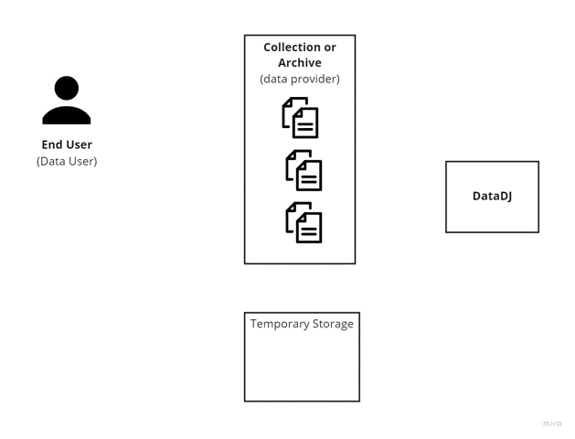

# DataDJ

Data DJ is a value-adding service for collections and archives, currently in development at ETH Library Lab, that helps to provide more convenient and efficient access to batches of digitised records and files. The service works in conjunction with collections' existing websites and search portals. The collection's website forwards the user's request for a list of files to the Data DJ, our service then gathers and compresses the files, and notifies the user via email with a convenient download link.



The requests to the sample application DataDJ can be accessed at https://data-dj-2021.oa.r.appspot.com/

If you are planning to work on this project, contact us to ask for the detailed internal documentation.

## Quickstart Guide


### 1. List available files (GET)
https://data-dj-2021.oa.r.appspot.com/files

You can call the endpoint within your browser or with `curl`.

Example:

```bash
curl https://data-dj-2021.oa.r.appspot.com/files 
```


### 2. Request an archive from the list of files

Edit the curl request below to include your `email` and the list of `files` that you want to download (note the included filepath).The endpoint can be called using `curl`. After a few minutes, you should receive an email with the download link.

Example:
```bash
curl https://data-dj-2021.oa.r.appspot.com/archive \
--include \
--header "Content-Type: application/json" \
--request "POST" \
--data '{"email":"your.name@librarylab.ethz.ch",
         "files":["data-mirror/cmt-001_1917_001_0015.jpg",
                   "data-mirror/cmt-001_1917_001_0019.jpg",
                   "data-mirror/cmt-001_1917_001_0057.jpg"]
        }'
```
---
## API Endpoints

### Listing all available files (GET)
https://data-dj-2021.oa.r.appspot.com/files

You can call the endpoint within your browser or with `curl`.

Example:

```bash
curl https://data-dj-2021.oa.r.appspot.com/files 
```

---

```bash
curl -X POST "0.0.0.0:8765/admin/revokeKey"  -H "Authorization: Bearer $ADMIN_KEY" -v -H "content:application/json" -d '{"apiKey":"sk_86d8f6adf1909657b772cdad84e691d8"}'
``` 


### Creating, modifying or downloading archives (POST)
https://data-dj-2021.oa.r.appspot.com/archive

This endpoint expects a request that contains three fields:

```json
{
  "email":"",
  "archiveID":"",
  "files":[]
}
```
`email` is a string, `archiveID` as well, being a truncated UUID as string and `files` is a list of strings containing the names of the files.
Depending on which fields are left empty, the API triggers different operations.


#### 1. Create an archive from a list of files

Both `email` and `archiveID` are left empty, whereas `files` contains the names of the files the archive should be initialised with. The endpoint can be called using `curl`.

Example:
```bash
curl https://data-dj-2021.oa.r.appspot.com/archive \
--include \
--header "Content-Type: application/json" \
--request "POST" \
--data '{"email":"your.name@librarylab.ethz.ch",
         "archiveID":"",
         "files":["data-mirror/cmt-001_1917_001_0015.jpg",
                   "data-mirror/cmt-001_1917_001_0019.jpg",
                   "data-mirror/cmt-001_1917_001_0057.jpg"]
        }'
```

#### 2. Add a list of files to an archive

`email` is left empty. `archiveID` contains the identifier of a previously created archive and `files` the list of files you want to add to the archive.

Example:
```bash
curl https://data-dj-2021.oa.r.appspot.com/archive \
--include \
--header "Content-Type: application/json" \
--request "POST" \
--data '{"email":"",
         "archiveID":"9d0b43d5",
         "files":["data-mirror/cmt-001_1917_001_0016.jpg",
                   "data-mirror/cmt-001_1917_001_0017.jpg",
                   "data-mirror/cmt-001_1917_001_0059.jpg"]
        }'
```

#### 3. Download an archive

`email` contains the email address the download link is being sent to, `archiveID` specifies the archive you want to download and `files` is left empty. The DataDj will send you a download link that allows you to download the archive as a .zip file.

Example:
```bash
curl https://data-dj-2021.oa.r.appspot.com/archive \
--include \
--header "Content-Type: application/json" \
--request "POST" \
--data '{"email":"your.name@librarylab.ethz.ch",
         "archiveID":"9d0b43d5",
         "files":[]
        }'
```

#### 4. Directly download a list of files as archive

`email` contains the email address the download link is being sent to, `archiveID` is left empty and `files` contains the names of the files you want to download.
The DJ creates an archive of the files in the request and will also return its identifier in the response, in case that archive needs to be accessed or modified later on. However it is not necessary to separatly trigger the notification containing the download link as this is going to happen automatically.

Example:
```bash
curl https://data-dj-2021.oa.r.appspot.com/archive \
--include \
--header "Content-Type: application/json" \
--request "POST" \
--data '{"email":"your.name@librarylab.ethz.ch",
         "archiveID":"",
         "files":["data-mirror/cmt-001_1917_001_0016.jpg",
                   "data-mirror/cmt-001_1917_001_0017.jpg",
                   "data-mirror/cmt-001_1917_001_0059.jpg"]
        }'
```

---

### Inspecting an archive (GET)

https://data-dj-2021.oa.r.appspot.com/archive/id

This endpoint allows to inspect the contents of an archive `id` either in the browser or via `curl`. The response is a JSON object that specifies the identifier and contents of the corresponding archive.

Example:
```bash
curl https://data-dj-2021.oa.r.appspot.com/archive/9d0b43d5
```


# Local Development

1. make a copy of `.env.example` and save it as `.env.local`    
1. replace the example directory paths, bucketnames and other settings as needed.  

_option a: run with go_  

download and run the redis image with docker 
```
docker pull redis
docker run --name dj-redis -p 6379:6379 -d redis
```
_start the task handler_  
open a terminal in project root.  
export all of the variables in the `.env.local` file  
run the task handler
```
source .env.local
export $(cut -d= -f1 .env.local)
go run ./taskHandler/*.go
```

open a separate terminal in project root.  
export all of the variables in the `.env.local` file  
run the api  
```
source .env.local && export $(cut -d= -f1 .env.local)
go run ./api/*.go
```
note that for any changes in the environment file to take effect, you must export the variables again and restart that part of the application.


_option b: (to be completed)_  
to run publisher and subscriber applications using docker. include the path to the .env.local file in the docker run command.
```
docker run --env-file=./.env.local -p 8080:8080 data-dj-image
```
### Docker commands
- `docker build --platform=linux/amd64 -f Dockerfile.api -t dj-api-amd64 .`
- `docker build --platform=linux/amd64 -f Dockerfile.taskHandler -t dj-taskhandler .`

### Steps for Google Cloud Run
- Follow instructions: [https://zahadum.notion.site/Google-Cloud-4c32dcbe1cfb4b479e8680e852ef0d84](https://zahadum.notion.site/Google-Cloud-4c32dcbe1cfb4b479e8680e852ef0d84)
- Setup redis instance in Memorystore
- Create VPC Connector for the VPC Network the redis instance is using
- Create secrets (secret manager) to store passwords and tokens
- Create Cloud Run Service and make sure to also add the following environment variables: REDISHOST and REDISPORT. You can find their respective values when looking at the previously created redis instance in the Memorystore
- Make sure to also choose the correct connector when creating the new service

send a request
```
curl http://0.0.0.0:8765/archive \
--include \
--request "POST" \
--header "Authorization: Bearer $USER_KEY" \
--header "Content-Type: application/json" \
--data '{"email":"barry.sunderland@librarylab.ethz.ch",
         "archiveID":"",
         "files":["local/cmt-001_1917_001_0016.jpg",
                   "local/cmt-001_1917_001_0017.jpg",
                   "local/cmt-001_1917_001_0059.jpg"]
        }'

```

curl -X POST "0.0.0.0:8765/admin/createKeyLink" \
    -H "Authorization: Bearer $ADMIN_KEY" \
    -H "content:application/json" \
    -d '{"email":"barry.sunderland@outlook.com"}'`


# Authentication

generates a token  
saves hashed token in mongo
middleware function validates token during requests

set mongo collection to delete a document after the given number of seconds.
Does not apply if the index field is not in the document e.g. if a doc does not have `expiryRequestedDate` it will not be deleted.
`db.apiKeys.createIndex( { "expiryRequestedDate": 1 }, { expireAfterSeconds: 3600 } )`


# Useful Reference Material for Go

- [Learning Go](https://learning.oreilly.com/library/view/learning-go/9781492077206/) by Jon Bodner  
general reference for programming in GO; types, syntax, imports etc.  
see Ch13 for writing tests

- [Cloud Native Go](https://learning.oreilly.com/library/view/cloud-native-go/9781492076322)


# Material for MongoDB

 http://www.inanzzz.com/index.php/post/g7e8/running-mongodb-migration-script-at-the-docker-startup 
